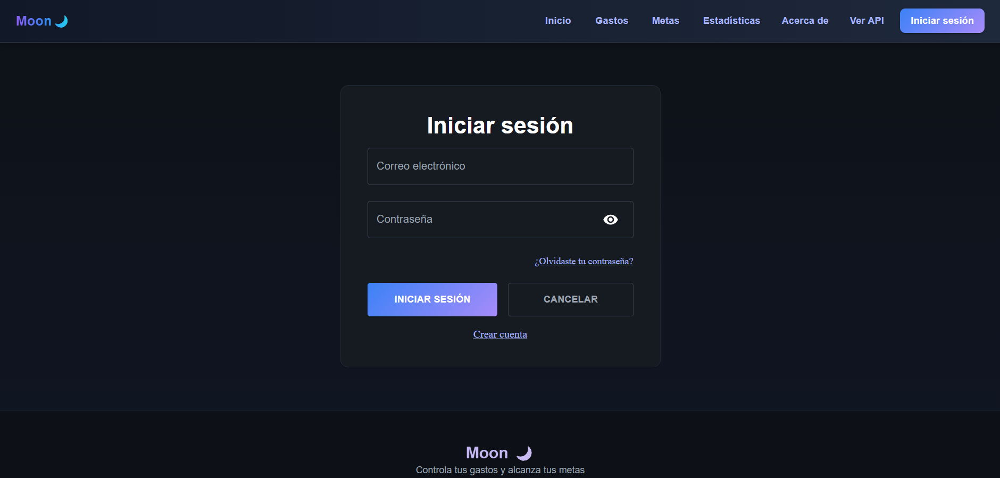
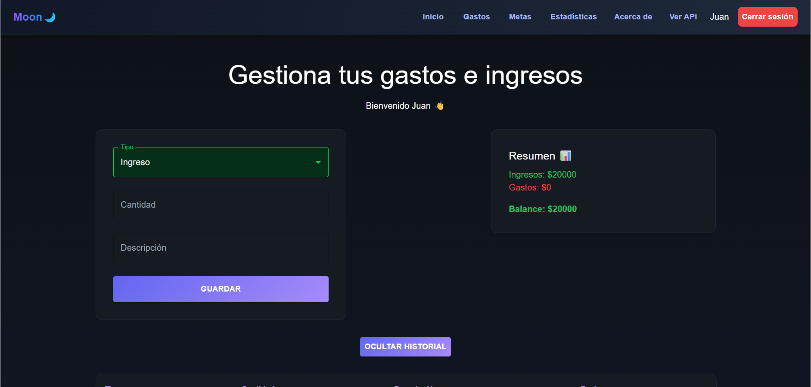

# 🌙 Moon – Control de Gastos Inteligente

## 📌 Descripción

Moon es una aplicación web desarrollada con React que permite a los usuarios gestionar sus ingresos y gastos de manera sencilla. Cuenta con autenticación de usuarios, almacenamiento en base de datos y una interfaz moderna.

El sistema permite registrar usuarios, iniciar sesión, guardar movimientos financieros y visualizar un historial personalizado por usuario.

---

## 🚀 Características principales

- 🔐 Registro e inicio de sesión con validación  
- 👤 Identificación de usuario (bienvenida personalizada)  
- 💰 Registro de ingresos y gastos  
- 📊 Cálculo automático de balance  
- 📋 Historial de movimientos por usuario  
- 🧠 Persistencia de datos con MongoDB Atlas  
- 🌐 Consumo de API con Axios  
- 🎨 Interfaz moderna con Material UI  
- 🚀 Deploy en producción (frontend + backend)

---

## 🛠️ Tecnologías utilizadas

### Frontend
- React  
- Vite  
- Material UI (MUI)  
- Axios  
- React Router  

### Backend
- Node.js  
- Express  
- MongoDB  
- Mongoose  
- bcrypt  

### Deploy
- :contentReference[oaicite:0]{index=0} (Frontend)  
- :contentReference[oaicite:1]{index=1} (Backend)  
- :contentReference[oaicite:2]{index=2} (Base de datos)

---

## 📁 Estructura del proyecto

```text
react4/
└── t4_proyect/
    ├── backend/
    │   ├── models/
    │   │   ├── User.js
    │   │   └── Gasto.js
    │   └── index.js
    │
    ├── public/
    ├── src/
    │   ├── features/
    │   │   ├── auth/
    │   │   │   └── components/
    │   │   │       └── Login.jsx
    │   │   ├── layout/
    │   │   │   ├── Header.jsx
    │   │   │   └── Footer.jsx
    │   │   ├── views/
    │   │   │   ├── Home.jsx
    │   │   │   ├── Gastos.jsx
    │   │   │   ├── Metas.jsx
    │   │   │   ├── Estadisticas.jsx
    │   │   │   └── ApiRyC.jsx
    │   ├── App.jsx
    │   └── main.jsx
```

---

## ⚙️ Instalación

```bash
git clone https://github.com/juanpenagos007-dotcom/taller4-react.git
cd t4_proyect
npm install
```

### Backend
```bash
cd backend
npm install
node index.js
```

### Frontend
```bash
npm run dev
```

---

## ▶️ Ejecución

- Backend: `node index.js`
- Frontend: `npm run dev`

---

## 📸 Screenshots

### Login


### Inicio


### Gastos


### Instalador


---

## 🌍 Deploy

- 🔵 Frontend: https://taller4-react-gg61.vercel.app  
- 🟢 Backend: https://taller4-backend.onrender.com  

---

## 👨‍💻 Autor

Juan Benitez  
📍 ADSO - SENA  
💻 Desarrollador Full Stack en formación
